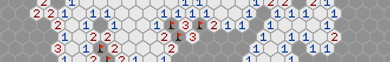

# Bestagon Mines



> Using olc::PixelGameEngine, see [License](#license).


My intro or "Hello World" project with the olcPGE.
Experimenting with a hexagonal grid and a minimal GUI implementation.


## Build

### Linux
Required software: `cmake`, `build-essential`
```
$ cd build/
$ ./build.sh [cleanAll] cmake make [&& ./pack.sh]
```

### Windows
Required software: `Visual Studio`
1. Build
    1. Open `prj/vs/bestagon-mines.sln`
    0. Build `Release | x86` and/or `Release | x64`
0. _optionally_ Run `pack*.bat` in the `build` directory.


---

## License

Bestagon Mines is licensed under OLC-3.

The following open source projects are used:

 - [olc::PixelGameEngine](https://github.com/OneLoneCoder/olcPixelGameEngine) Copyright 2018 - 2021 OneLoneCoder.com
